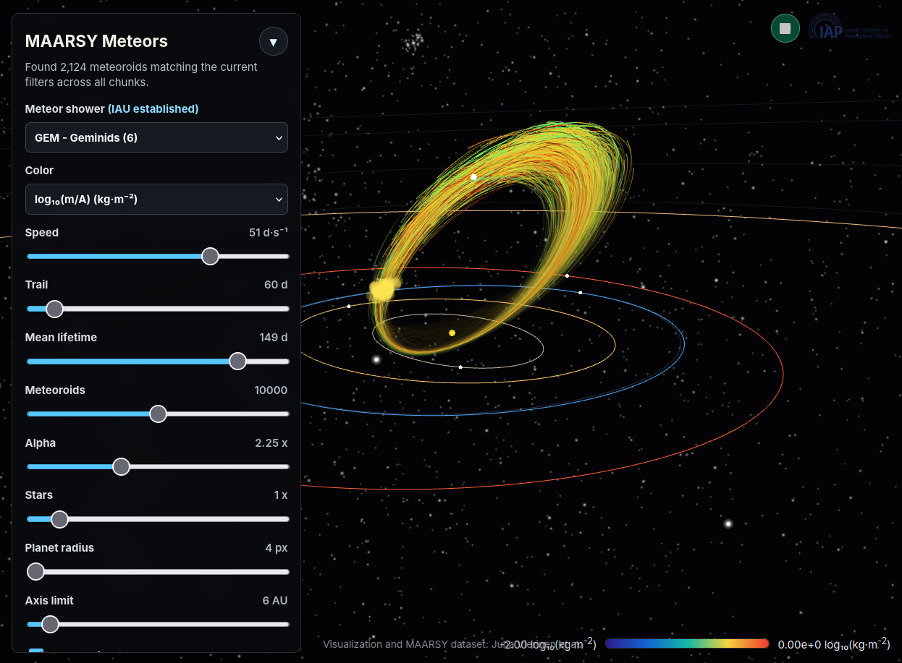

# Meteor trajectory visualizers

Developed by Etienne Gavazzi, Juha Vierinen, and Daniel Kastinen (2024). 

This repository contains both a Julia version and a JavaScript/WebGL version of
the meteor orbit visualizer. The JavaScript version is online at
<https://juha.no/meteors/>. The visualizations are based on MAARSY meteor head
echo measurements from 2016-2026.

# Example



# JavaScript Web Visualizer

The WebGL visualizer lives in `web/` and uses an embedded export of the MAARSY
meteor orbit catalogue. It animates meteor and planet orbits from Keplerian
elements in JavaScript, with WebGL rendering. The Tycho-2 catalogue is used to
render the background stars. The IAU Meteor Data Center meteor shower database
is used for meteor shower definitions, and Minor Planet Center orbit catalogues
are used for the orbital elements of meteor shower parent bodies.

# Setup

Install the small Python toolchain used by the export scripts:

```sh
python -m pip install -r requirements.txt
```

Open the single-file standalone page directly in a browser:

```sh
xdg-open web/standalone.html
```

The GUI includes color selection, playback speed, trail length, alpha, point
size, a 0 to 100 AU axis-limit slider, and filters for the displayed orbital
parameters.

# Data Sources

Large or external catalog inputs are no longer committed to the repository.

- `web/export_catalog_chunks.py` will automatically download `data/maarsy_dataset.h5` from Zenodo if it is missing.
- `export_parent_bodies.py` will automatically download `data/NEA.txt` and `data/CometEls.txt` from the official MPC endpoints if they are missing.
- `data/streamestablisheddata2026.txt` is kept in the repository because it is small and directly used by the web exports.
- `embed_tycho_catalog.py` expects a locally prepared `tycho2_mag8.bin.gz` and `tycho2_mag8.json` derived from the ESA Tycho-2 catalogue. The upstream Tycho-2 catalog is published by ESA at `https://www.cosmos.esa.int/web/hipparcos/tycho-2`.

The full MAARSY HDF5 source is published on Zenodo:

```text
https://zenodo.org/records/17139689/files/maarsy_dataset.h5?download=1
```

If a browser is already downloading `data/maarsy_dataset.h5`, the export script will not start a second download while the partial `.crdownload` file is present.

# Regeneration

Regenerate the streamed web catalogue from the full MAARSY HDF5:

```sh
python web/export_catalog_chunks.py
python build_standalone.py
```

Regenerate the parent-body overlay:

```sh
python export_parent_bodies.py
```
