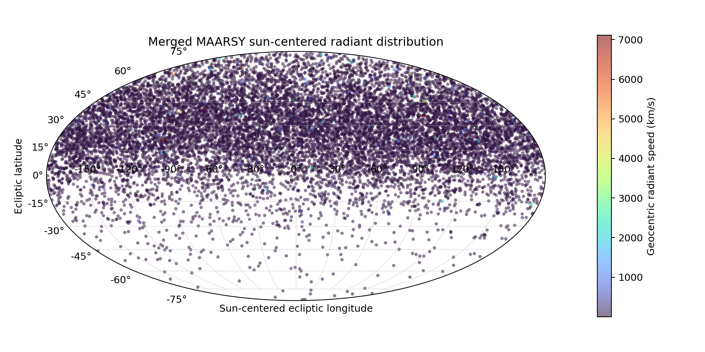
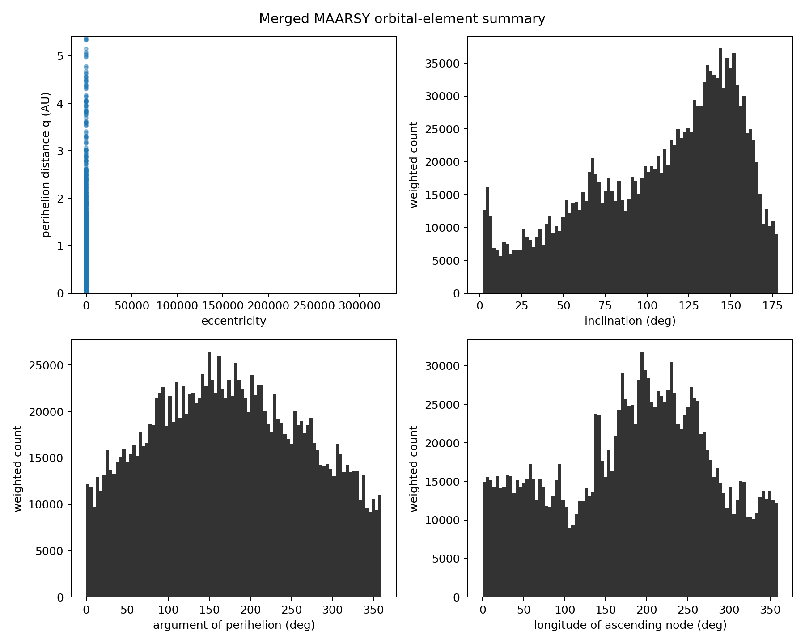

# MAARSY Jopek D_H Reduction Report

Input file: `/home/j/src/meteor_viz/data/maarsy_dataset.h5`
Output file: `/home/j/src/meteor_viz/data/maarsy_dataset_jopek_dh_reduced.h5`

## Method

The reducer ignores anomaly for similarity and uses the five orbital elements used by meteor D-criteria: perihelion distance `q`, eccentricity `e`, inclination `i`, argument of perihelion `omega`, and longitude of ascending node `Omega`.

Jopek's `D_H` criterion was implemented as the Southworth-Hawkins form with the perihelion-distance term normalized by `(q_B + q_A)`, following Rozek, Breiter & Jopek 2011, section 2: <https://academic.oup.com/mnras/article/412/2/987/1079008>.

Because an exact all-pairs search over roughly 1.6 million meteors would require trillions of comparisons, each round builds a KD-tree in a smooth orbital feature embedding, scores KD-tree candidate edges with exact `D_H`, then greedily merges disjoint closest pairs. Any rare unmatched leftovers are paired by feature order, and a final odd object is carried forward unchanged.

Cluster centres are weighted means of scalar datasets. Angular columns `omega`, `Omega`, and anomaly are circular means. The anomaly is not used when choosing similar meteors, but it is retained as an averaged output column for compatibility.

The HDF5 output stores one group per saved merge factor, e.g. `merge_factor_128`. Each group contains `kepler`, `kepler_std`, `kepler_epoch_unix_second`, `mass_to_area_kg_per_m2`, `n_members`, `representative_source_index`, `representative_event_id`, and `perihelion_distance_au`.

## Reduction Levels

| Merge factor | Centres | Pair count | Carry count | Median pair D_H | 95% pair D_H | Max pair D_H |
|---:|---:|---:|---:|---:|---:|---:|
| 16 | 99963 | 99962 | 1 | 0.0988051 | 1.58567 | 522385 |
| 32 | 49982 | 49981 | 1 | 0.120655 | 1.59987 | 762848 |
| 64 | 24991 | 24991 | 0 | 0.144714 | 1.59763 | 806164 |
| 128 | 12496 | 12495 | 1 | 0.172045 | 1.65164 | 281453 |

## Final Level Summary

Final merge factor: `128`
Final centres: `12496`
Members per centre: median `128.0`, min `54`, max `128`
Weighted median eccentricity: `0.679103`
Weighted median perihelion distance: `0.802655 AU`
Radiants computed for `12494` centres; `2` centres had invalid two-body states.
Median geocentric radiant speed among valid centres: `45.276 km/s`

## Figures

## Notes

The original request said `N=16` should yield about 10,000 meteors. With 1,599,393 inputs, `N=16` yields about 100,000 centres; the report therefore includes powers of two through `N=128`, which gives about 12,500 centres.
